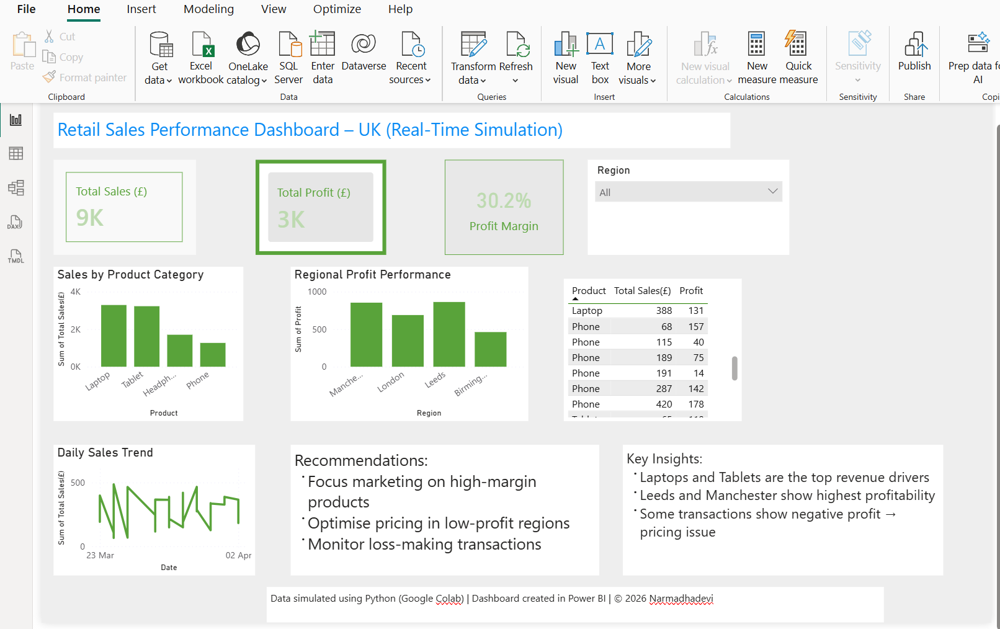

# 📊 Retail Sales Performance Dashboard – UK (Real-Time Simulation)

## 🔍 Project Overview

This project demonstrates a real-time retail sales analysis pipeline, where simulated transaction data is generated using Python and visualised through an interactive Power BI dashboard. The goal is to transform raw data into meaningful business insights for decision-making.

---

## 🎯 Business Problem

Retail businesses need to monitor sales, profitability, and regional performance to optimise operations and maximise revenue. This project provides a dashboard solution to track key performance indicators and identify trends.

---

## 🛠 Tools & Technologies

* Python (Google Colab)
* Pandas (Data Analysis)
* Power BI (Dashboard & Visualisation)

---

## 🔄 Data Pipeline

1. Simulated real-time sales data generated using Python
2. Data stored in CSV format
3. Data processed and analysed using Pandas
4. Data visualised using Power BI dashboard

---

## 📊 Dashboard Features

* KPI Metrics: Total Sales, Total Profit, Profit Margin
* Sales by Product Category
* Regional Profit Analysis
* Daily Sales Trend
* Interactive filtering (Region slicer)

---

## 📈 Key Insights

* Laptops and Tablets are the top revenue-generating products
* Leeds and Manchester show the highest profitability
* Some transactions generate negative profit, indicating pricing or cost issues
* Sales trends vary across different days

---

## 💡 Recommendations

* Focus marketing efforts on high-margin products
* Optimise pricing strategies in low-profit regions
* Monitor and reduce loss-making transactions

---

## 📸 Dashboard Preview

---

## 📁 Project Structure

* data/ → Dataset
* notebooks/ → Data analysis (Colab notebook)
* scripts/ → Python scripts 
* dashboard/ → Power BI file & screenshot

---

## 🚀 Author
Narmadhadevi Palaniappan
